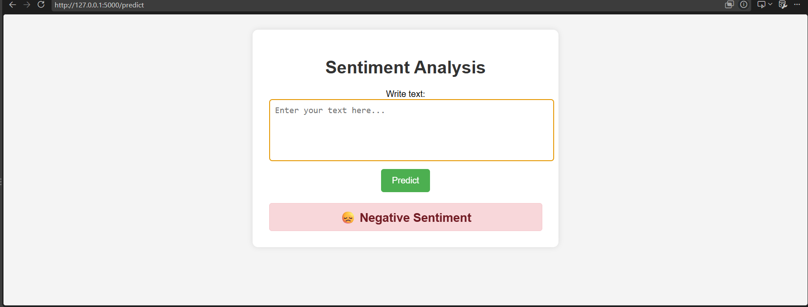
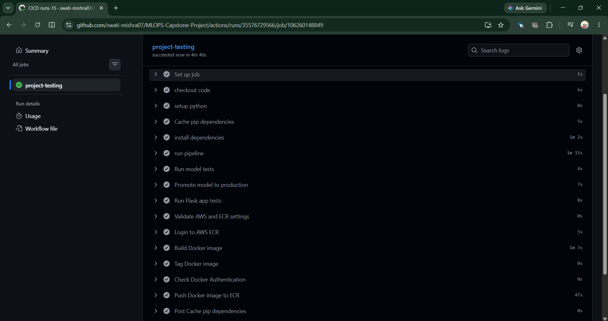
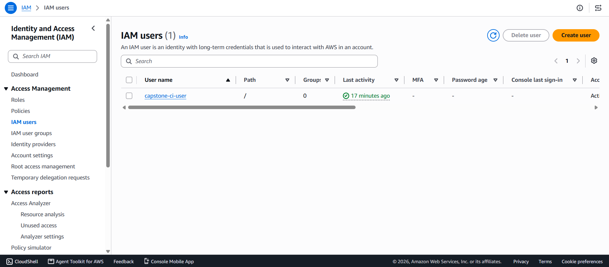
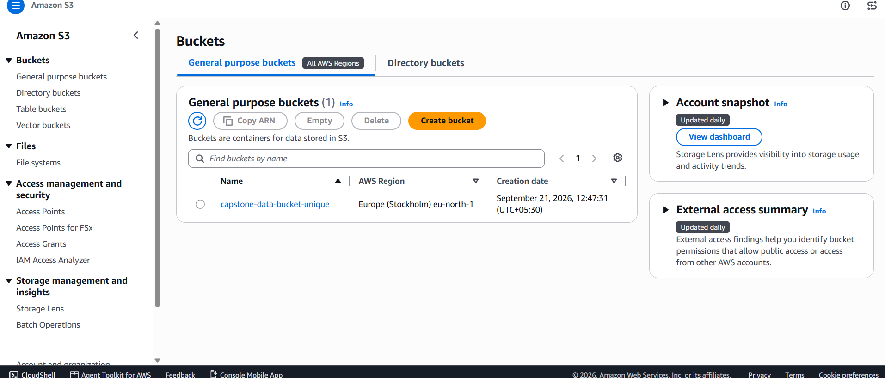
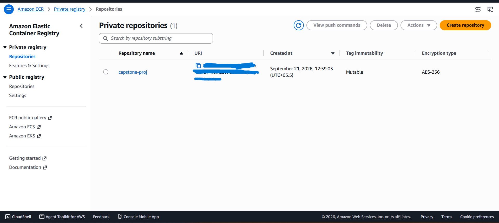
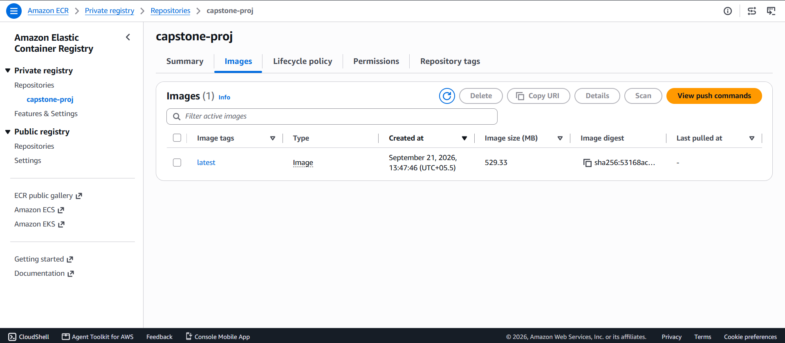

# Mlops-Sentiment-Analysis-Pipeline: End-to-End Sentiment Analysis Pipeline

An end-to-end MLOps project that takes a text sentiment model from experimentation to a containerized web app, with **reproducible pipelines (DVC)**, **experiment tracking and model registry (MLflow on DagsHub)**, **remote data storage (AWS S3)**, and a **CI/CD pipeline (GitHub Actions)** that tests the model and app, then builds and pushes a Docker image to **AWS ECR**.

**Highlights**

- Reproducible 6-stage DVC pipeline with parameters in `params.yaml`
- Every run tracked in MLflow on DagsHub, with a model registry
- CI on every push: run pipeline, test model, promote model, test app, build and push image to ECR
- Small, containerized Flask app (image about 530 MB in ECR)


---

## Table of Contents

- [Mlops-Sentiment-Analysis-Pipeline: End-to-End Sentiment Analysis Pipeline](#mlops-capstone-project-end-to-end-sentiment-analysis-pipeline)
  - [Table of Contents](#table-of-contents)
  - [Project Status](#project-status)
  - [Application Preview](#application-preview)
  - [Architecture](#architecture)
  - [Tech Stack](#tech-stack)
  - [Repository Structure](#repository-structure)
  - [ML Pipeline (DVC)](#ml-pipeline-dvc)
  - [Model Performance](#model-performance)
  - [Experiment Tracking and Model Registry](#experiment-tracking-and-model-registry)
  - [Flask Web App](#flask-web-app)
  - [Docker](#docker)
  - [CI/CD Pipeline](#cicd-pipeline)
    - [Required GitHub secrets and variables](#required-github-secrets-and-variables)
  - [AWS Setup](#aws-setup)
  - [Getting Started](#getting-started)
    - [Prerequisites](#prerequisites)
    - [Setup](#setup)
    - [How the project was built (short version)](#how-the-project-was-built-short-version)
  - [Extension: Deploying on EKS with Prometheus and Grafana](#extension-deploying-on-eks-with-prometheus-and-grafana)
  - [Cost Notes and Cleanup](#cost-notes-and-cleanup)
  - [Security Notes](#security-notes)
  - [Key Learnings](#key-learnings)
  - [Future Improvements](#future-improvements)
  - [Author](#author)
  - [License](#license)

---

## Project Status

| Stage | Status |
|-------|--------|
| Project structure (Cookiecutter Data Science) | Done |
| Experiment tracking with MLflow on DagsHub | Done |
| DVC pipeline (ingestion to model registration) | Done |
| S3 as DVC remote storage | Done |
| Flask app with the trained model | Done |
| Tests (model tests and Flask app tests) | Done |
| CI pipeline on GitHub Actions | Done |
| Docker image build and push to **AWS ECR** | Done |
| Deployment to **AWS EKS** | Not deployed on AWS (cost), see [Extension](#extension-deploying-on-eks-with-prometheus-and-grafana) |
| Monitoring with Prometheus and Grafana | Practiced locally on Minikube (separate repo linked below) |

---

## Application Preview

The Flask app takes a piece of text and predicts whether the sentiment is positive or negative.



---

## Architecture

```
┌───────────┐   ┌──────────────┐   ┌────────────────────────────────────────┐
│  GitHub   │──►│GitHub Actions│──►│ 1. Install deps  2. dvc repro pipeline │
│  (push)   │   │   (CI/CD)    │   │ 3. Model tests   4. Promote model      │
└───────────┘   └──────────────┘   │ 5. Flask app tests                     │
                                   └───────────────┬────────────────────────┘
                                                   ▼
                              ┌─────────────────────────────────┐
                              │ Build Docker image → Push to ECR│
                              └────────────────┬────────────────┘
                                               ▼
                              (Extension) EKS Deployment + LoadBalancer
                                               ▼
                              (Extension) Prometheus ──► Grafana

  DagsHub / MLflow : experiment tracking + model registry
  AWS S3           : DVC remote storage for data and artifacts
```

---

## Tech Stack

| Area | Tools |
|------|-------|
| Language | Python 3.10 |
| Project template | Cookiecutter Data Science |
| Data and pipeline versioning | DVC (with S3 remote) |
| Experiment tracking, model registry | MLflow hosted on DagsHub |
| Text preprocessing | NLTK (stopwords, WordNet) |
| Web app | Flask |
| Containerization | Docker |
| CI/CD | GitHub Actions |
| Cloud | AWS S3, IAM, ECR (EKS in the extension) |
| Monitoring (extension) | Prometheus, Grafana |

---

## Repository Structure

```
MLOPS-Capstone-Project/
├── .dvc/                   # DVC configuration
├── .github/workflows/      # CI/CD workflow (GitHub Actions)
├── data/                   # Raw, interim and processed data (tracked by DVC)
├── assets/                 # Screenshots used in this README
├── docs/                   # Documentation
├── flask_app/              # Flask web application
├── models/                 # Trained model and vectorizer (tracked by DVC)
├── notebooks/              # Experiment notebooks
├── references/             # Reference material
├── reports/                # metrics.json, experiment_info.json
├── scripts/                # Helper scripts used by CI (for example model promotion)
├── src/
│   ├── data/               # data_ingestion.py, data_preprocessing.py
│   ├── features/           # feature_engineering.py
│   ├── model/              # model_building.py, model_evaluation.py, register_model.py
│   └── logger/             # Logging setup
├── tests/                  # Model and Flask app tests
├── Dockerfile              # Container image for the Flask app
├── dvc.yaml                # DVC pipeline definition
├── dvc.lock                # Locked pipeline state
├── params.yaml             # Pipeline parameters
├── projectflow.txt         # Step-by-step build notes
├── requirements.txt
├── Makefile
├── setup.py
├── tox.ini
└── LICENSE
```

---

## ML Pipeline (DVC)

The pipeline is defined in `dvc.yaml` and has six stages:

| Stage | Command | Outputs |
|-------|---------|---------|
| `data_ingestion` | `python -m src.data.data_ingestion` | `data/raw` |
| `data_preprocessing` | `python -m src.data.data_preprocessing` | `data/interim` |
| `feature_engineering` | `python -m src.features.feature_engineering` | `data/processed`, `models/vectorizer.pkl` |
| `model_building` | `python -m src.model.model_building` | `models/model.pkl` |
| `model_evaluation` | `python -m src.model.model_evaluation` | `reports/metrics.json` (metrics), `reports/experiment_info.json` |
| `model_registration` | `python -m src.model.register_model` | Registers the model in the MLflow registry |

Parameters live in `params.yaml`:

```yaml
data_ingestion:
  test_size: 0.25

feature_engineering:
  max_features: 50
```

Run the full pipeline:

```bash
dvc repro      # runs only the stages whose dependencies changed
dvc status     # check what is out of date
dvc push       # push data and models to the S3 remote
```

---

## Model Performance

Metrics on the held-out test set (25% split), written by the `model_evaluation` stage to `reports/metrics.json`:

| Metric | Score |
|--------|-------|
| Accuracy | 0.7118 (71.2%) |
| Precision | 0.7131 |
| Recall | 0.7230 |
| AUC | 0.7861 |

```json
{
  "accuracy": 0.71184,
  "precision": 0.7131083812781838,
  "recall": 0.7230017341951758,
  "auc": 0.7861422040044143
}
```

The model is kept simple (the vectorizer is capped at `max_features: 50`) because the focus of this project is the MLOps workflow (tracking, pipelines, CI/CD and deployment) rather than getting the best possible accuracy. Precision and recall are well balanced, so the model is not strongly biased toward one sentiment class. Raising `max_features` in `params.yaml` and re-running `dvc repro` is the easiest way to try to improve the scores, and every run is logged in MLflow for comparison.

---

## Experiment Tracking and Model Registry

- Experiments are run in notebooks first, then moved into the `src/` modules.
- Runs, metrics and models are logged to **MLflow hosted on DagsHub**.
- `model_evaluation` writes `reports/experiment_info.json`, and `register_model` uses it to register the model in the MLflow Model Registry.
- In CI, the model is promoted to production only after the model tests pass.

The DagsHub token is read from an environment variable (`CAPSTONE_TEST`), never hard-coded. In GitHub it is stored as a repository secret.

---

## Flask Web App

The `flask_app/` folder contains the web app that serves sentiment predictions from the trained model, using the saved `models/vectorizer.pkl` to transform the input text. It runs on port `5000`.

Run locally:

```bash
cd flask_app
pip install -r requirements.txt
export CAPSTONE_TEST=<your-dagshub-token>     # Windows PowerShell: $env:CAPSTONE_TEST="<token>"
python app.py
```

Open `http://127.0.0.1:5000`.

---

## Docker

```dockerfile
FROM python:3.10-slim-bookworm
WORKDIR /app
COPY flask_app/ /app/
COPY models/vectorizer.pkl /app/models/vectorizer.pkl
RUN pip install -r requirements.txt
RUN python -m nltk.downloader stopwords wordnet
EXPOSE 5000
CMD ["python", "app.py"]        # local
# CMD ["gunicorn", "--bind", "0.0.0.0:5000", "--timeout", "120", "app:app"]   # production
```

Build and run:

```bash
docker build -t capstone-app:latest .

# The app needs the DagsHub token at runtime
docker run -p 8888:5000 -e CAPSTONE_TEST=<your-dagshub-token> capstone-app:latest
```

Open `http://localhost:8888`. Without the environment variable the container fails on start with an error saying the variable is not set.

Notes:

- Only `flask_app/` and `models/vectorizer.pkl` are copied into the image, which keeps it small.
- NLTK `stopwords` and `wordnet` are downloaded at build time for text preprocessing.
- For production, switch the `CMD` to the commented `gunicorn` line.

---

## CI/CD Pipeline

The GitHub Actions workflow (`.github/workflows/`) runs on every push. One job, `project-testing`, runs these steps in order:

| # | Step | Purpose |
|---|------|---------|
| 1 | Checkout code | Get the repository |
| 2 | Set up Python | Python 3.10 |
| 3 | Cache pip dependencies | Faster installs |
| 4 | Install dependencies | `pip install -r requirements.txt` |
| 5 | Run pipeline | `dvc repro` |
| 6 | Run model tests | Validate the trained model |
| 7 | Promote model to production | Update the MLflow registry stage |
| 8 | Run Flask app tests | Validate the API and UI |
| 9 | Validate AWS and ECR settings | Fail early if secrets are missing |
| 10 | Login to AWS ECR | Authenticate Docker to ECR |
| 11 | Build Docker image | Build from the `Dockerfile` |
| 12 | Tag Docker image | Tag for the ECR repository |
| 13 | Check Docker authentication | Sanity check before push |
| 14 | Push Docker image to ECR | Publish the image |

A successful run of the full pipeline:



### Required GitHub secrets and variables

| Name | Description |
|------|-------------|
| `CAPSTONE_TEST` | DagsHub access token used for MLflow authentication |
| `AWS_ACCESS_KEY_ID` | Access key of the CI IAM user (create your own; never commit it) |
| `AWS_SECRET_ACCESS_KEY` | Secret key of the CI IAM user |
| `AWS_REGION` | AWS region (this project uses `eu-north-1`, Stockholm) |
| `AWS_ACCOUNT_ID` | AWS account ID |
| `ECR_REPOSITORY` | ECR repository name (`capstone-proj`) |

---

## AWS Setup

**IAM user for CI.** A dedicated user (`capstone-ci-user`) with programmatic access for GitHub Actions, with the `AmazonEC2ContainerRegistryFullAccess` policy so it can push images to ECR. For a real project, use a tighter custom policy or GitHub OIDC instead of long-lived keys.



**S3 bucket as the DVC remote.** Data and model artifacts are pushed here with `dvc push`.



```bash
pip install "dvc[s3]" awscli
aws configure          # enter your own access key, secret key and region (eu-north-1)
dvc remote add -d myremote s3://<your-bucket-name>
```

**ECR repository.** The CI pipeline pushes the image to a private repository named `capstone-proj`.



After a successful pipeline run, the `latest` image is available in ECR:



---

## Getting Started

### Prerequisites

- Python 3.10 (Conda recommended)
- Docker Desktop
- A [DagsHub](https://dagshub.com) account with this repo connected, and an access token
- An AWS account with an S3 bucket and IAM user (for the S3 remote and ECR)

### Setup

```bash
# 1. Clone
git clone https://github.com/swati-mishra07/MLOPS-Capstone-Project.git
cd MLOPS-Capstone-Project

# 2. Create and activate the environment
conda create -n atlas python=3.10
conda activate atlas

# 3. Install dependencies
pip install -r requirements.txt

# 4. Set the DagsHub token
export CAPSTONE_TEST=<your-dagshub-token>      # PowerShell: $env:CAPSTONE_TEST="<token>"

# 5. Configure AWS and pull data from the S3 remote
aws configure
dvc pull

# 6. Reproduce the pipeline
dvc repro

# 7. Run the app
cd flask_app && python app.py
```

### How the project was built (short version)

1. Created the repo and project skeleton with Cookiecutter Data Science
2. Set up MLflow tracking on DagsHub and ran experiment notebooks
3. Turned notebook code into `src/` modules and defined the DVC pipeline
4. Added S3 as the DVC remote
5. Built the Flask app, then containerized it
6. Added tests and the GitHub Actions pipeline
7. Set up ECR and extended the pipeline to push the image

The complete command-by-command notes are in [`projectflow.txt`](projectflow.txt).

---

## Extension: Deploying on EKS with Prometheus and Grafana

The full project plan continues from ECR to Kubernetes on AWS. I stopped at ECR because running EKS (control plane, EC2 nodes, load balancer) and two monitoring EC2 instances costs real money. Instead, I learned and practiced the Kubernetes and monitoring parts locally on Minikube:

- **Local Kubernetes and monitoring project:** [Prometheus-Grafana-Minikube-Project](https://github.com/swati-mishra07/Prometheus-Grafana-Minikube-Project)
- **Kubernetes basics project:** [K8s-Mini-Project](https://github.com/swati-mishra07/K8s-Mini-Project)

The planned AWS deployment flow (not run on AWS):

1. **Create the cluster** with `eksctl` (managed node group, one `t3.small` node, `eu-north-1`), then confirm with `kubectl get nodes`:

   ```bash
   eksctl create cluster --name flask-app-cluster --region eu-north-1 \
     --nodegroup-name flask-app-nodes --node-type t3.small \
     --nodes 1 --nodes-min 1 --nodes-max 1 --managed
   ```
2. **Deploy the app** with a Kubernetes `Deployment` that pulls the image from ECR, and a `LoadBalancer` `Service` on port `5000`. The DagsHub token is passed in as a Kubernetes `Secret`. The node security group needs an inbound rule for port `5000`.
3. **Get the external address** with `kubectl get svc` and test with `curl http://<external-address>:5000`.
4. **Prometheus on an EC2 instance** (`t3.medium`, ports `9090` and `22` open), scraping the app's load balancer address on a 15 s interval.
5. **Grafana on a second EC2 instance** (port `3000` open), with Prometheus added as a data source.

Useful concepts noted while planning:

- `eksctl` creates the cluster through **CloudFormation stacks** (one for the control plane, one for the node group). Always confirm the stacks are deleted after teardown.
- Node group creation can fail with a **Fleet Request quota** error if the account has hit its limit.
- A **PVC (PersistentVolumeClaim)** is a request for storage that Kubernetes binds to a PersistentVolume, provisioned through a StorageClass (for example EBS on AWS).

---

## Cost Notes and Cleanup

AWS resources that keep running keep billing. If you follow the EKS extension, tear everything down afterwards:

```bash
kubectl delete deployment flask-app
kubectl delete service flask-app-service
kubectl delete secret capstone-secret
eksctl delete cluster --name flask-app-cluster --region eu-north-1
eksctl get cluster --region eu-north-1       # verify it is gone
```

Then delete the ECR repository and S3 bucket if no longer needed, terminate the Prometheus and Grafana EC2 instances, and check CloudFormation to confirm the stacks are deleted.

---

## Security Notes

- Never commit tokens or keys. `CAPSTONE_TEST` and all AWS credentials live in GitHub Secrets or local environment variables.
- Rotate any credential that was ever committed or shared, and delete unused access keys.
- Screenshots in `assets/` have the AWS account ID and repository URI removed.

---

## Key Learnings

- How MLOps ties together data versioning, experiment tracking, testing, packaging and deployment
- Why DVC pipelines and `params.yaml` make training reproducible
- Using MLflow and DagsHub for tracking and a model registry, and promoting models only after tests pass
- Keeping credentials out of code by using GitHub secrets and environment variables
- Building a CI pipeline that tests both the model and the app before publishing a Docker image
- How Kubernetes, Prometheus and Grafana fit in after the image is built, and how cloud cost shapes what you deploy

---

## Future Improvements

- Deploy on EKS (or a cheaper option such as a single small VM or a managed container service) and add a CD step
- Instrument the Flask app with `prometheus_client` and add a `/metrics` endpoint
- Add data and model drift monitoring
- Add alerting rules in Prometheus or Grafana
- Move the CI IAM user to GitHub OIDC so no long-lived AWS keys are stored
- Improve the model (larger vocabulary, better features or a stronger classifier) and compare runs in MLflow

---

## Author

**Swati Mishra** ([@swati-mishra07](https://github.com/swati-mishra07))

Related learning projects: [K8s-Mini-Project](https://github.com/swati-mishra07/K8s-Mini-Project) and [Prometheus-Grafana-Minikube-Project](https://github.com/swati-mishra07/Prometheus-Grafana-Minikube-Project)

---

## License

This project is licensed under the [MIT License](LICENSE).
